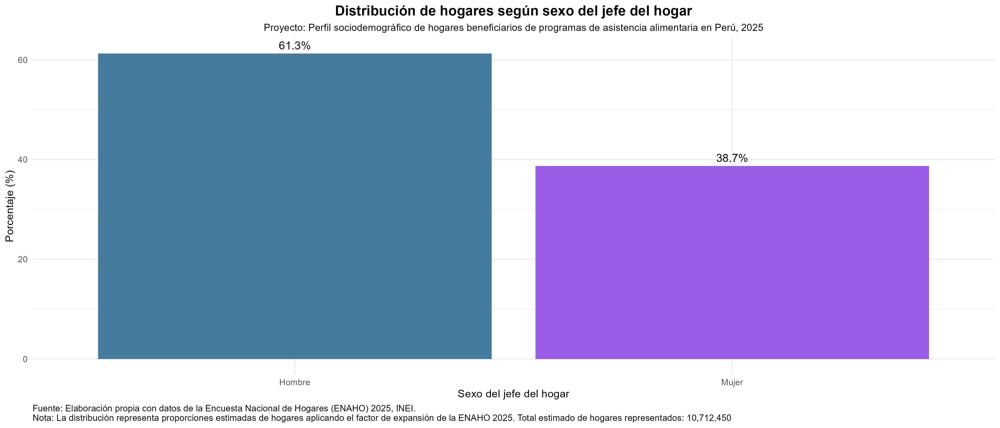
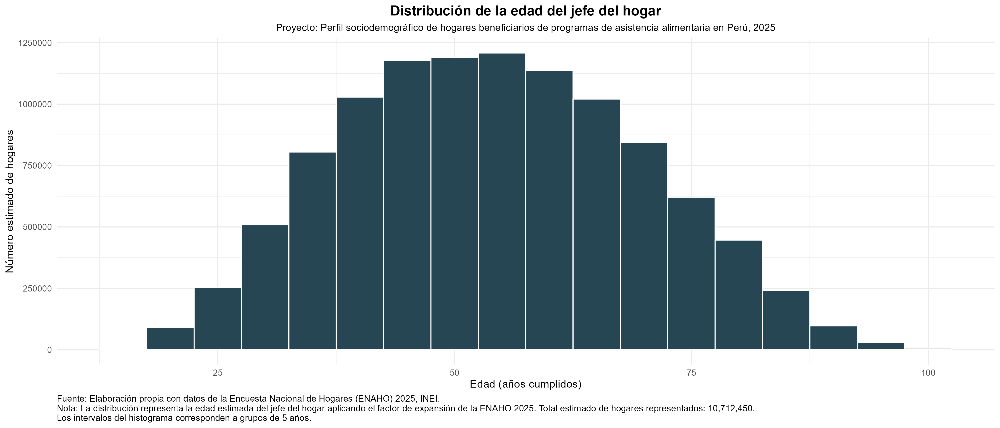
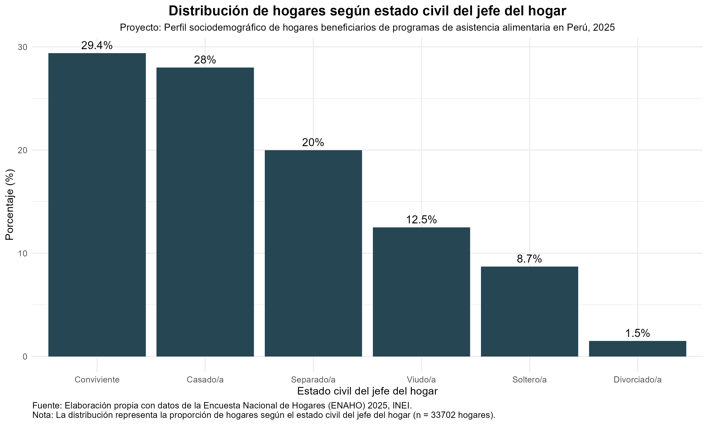
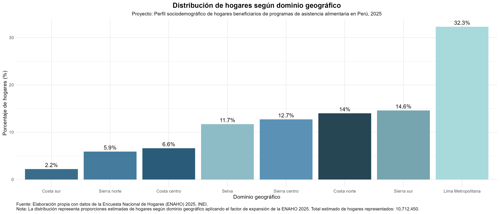
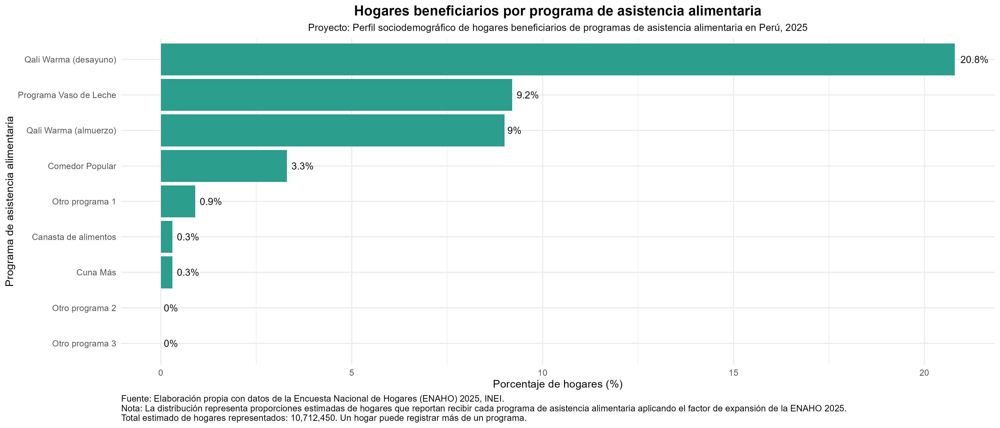
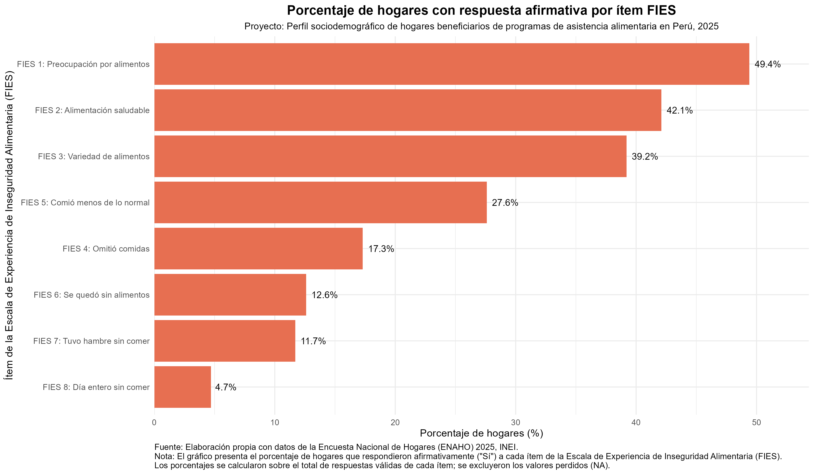
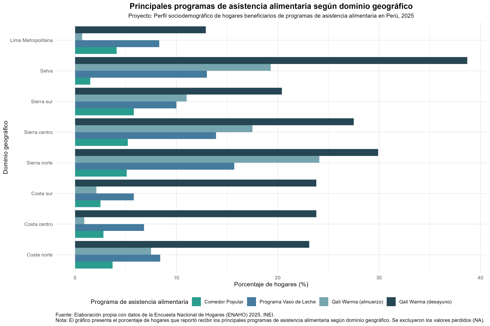
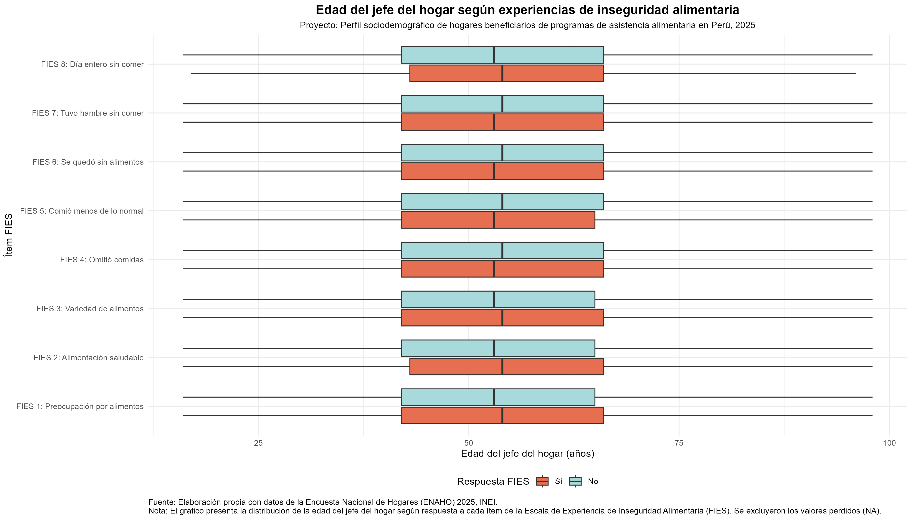

```{r setup, include=FALSE}
knitr::opts_chunk$set(
  echo = FALSE,
  warning = FALSE,
  message = FALSE
)
```

```{r Cargar librerías, include=FALSE}
library(tidyverse)
library(arrow)
library(htmltools)
library(knitr)
```

```{r Cargar base de datos, include=FALSE}
enaho_2025 <- read_parquet("../01_datos/procesados/enaho_2025_v5.parquet")
```

# Introducción
Este informe presenta los resultados del análisis exploratorio de datos sobre el perfil sociodemográfico de los hogares beneficiarios de programas de asistencia alimentaria en el Perú, elaborado a partir de los microdatos de la Encuesta Nacional de Hogares (ENAHO) 2025 del Instituto Nacional de Estadística e Informática (INEI).

El objetivo de este informe es describir la distribución de las principales características sociodemográficas de los hogares beneficiarios y explorar el comportamiento de las variables de interés. En consecuencia, el informe tiene un carácter exclusivamente descriptivo y no busca establecer relaciones causales.

---

# Ficha técnica
- **Fuente de datos**: Encuesta Nacional de Hogares (ENAHO), INEI, 2025. 
- **Periodo**: Anual (enero-diciembre).
- **Unidad de análisis**: Hogar, representado por el jefe de hogar.
- **Módulos utilizados**: Módulo 200 (Características de los miembros del hogar), Módulo 700 (Programas Sociales) y Módulo 130 (Inseguridad Alimentaria).
- **Diseño muestral**: Las estimaciones descriptivas y bivariadas incorporan el factor de expansión de la ENAHO 2025 para obtener resultados representativos de los hogares del país.
- **Hogares en la muestra analizada**: `r format(nrow(enaho_2025), big.mark = ",")` hogares.
- **Hogares representados estimados**: `r format(round(sum(enaho_2025$factor07, na.rm = TRUE)), big.mark = ",")` hogares.

---

# ¿Quiénes encabezan los hogares? Perfil sociodemográfico del jefe de hogar

## Una mayoría masculina con presencia femenina significativa: distribución por sexo

**Figura 1.**
```{r Gráfico de barras: Distribución de hogares según sexo del jefe del hogar"}

```
En los hogares beneficiarios de programas de asistencia alimentaria predomina la jefatura masculina, que representa el 61.3% de los casos. Esto indica que, dentro de la población analizada, la mayoría de hogares tiene a un hombre como jefe de hogar. Sin embargo, la participación de hogares con jefatura femenina también es relevante, ya que alcanza el 38.7% de los hogares beneficiarios estimados. Esto evidencia que la condición de beneficiario no se restringe a un único perfil de jefatura y que existe diversidad en la composición de los hogares atendidos.

## Una población madura: distribución por edad

**Tabla 1**
```{r Tabla Descriptiva: Edad del jefe del hogar"}
htmltools::includeHTML("../03_outputs/explorar_tabla_edad_jefe.html")
```
Los hogares beneficiarios de programas de asistencia alimentaria presentan un perfil predominantemente adulto. El primer cuartil indica que el 75% de los jefes de hogar tiene 42 años o más, mientras que la edad promedio alcanza los 54.2 años. Sin embargo, la desviación estándar (DE = 15.5 años) muestra una dispersión considerable en la distribución, con edades que abarcan desde jefaturas jóvenes hasta edades avanzadas (mínimo = 16 años, máximo = 98 años). En conjunto, estos resultados sugieren que, aunque existe una mayor concentración de jefaturas adultas, la población estimada de hogares beneficiarios presenta heterogeneidad en términos etarios.

**Figura 2**
```{r Histograma: Distribución de la edad del jefe del hogar"}

```
El histograma muestra una distribución aproximadamente simétrica y unimodal de la edad de los jefes de hogar beneficiarios, con una mayor concentración de hogares representados alrededor de los 50 y 55 años. La cercanía entre la media y la mediana evidencia una distribución sin una marcada concentración hacia edades extremas. Asimismo, se observa una reducción progresiva de hogares hacia las edades más jóvenes y avanzadas, aunque existe representación en todo el rango etario. En conjunto, el gráfico muestra una mayor presencia de jefaturas adultas, manteniendo heterogeneidad en la composición etaria de los hogares beneficiarios.

## Entre la convivencia y la separación: estado civil del jefe de hogar

**Tabla 2**
```{r Tabla de frecuencias: Distribución de hogares según estado civil del jefe del hogar"}
htmltools::includeHTML("../03_outputs/explorar_tabla_ecivil_jefe.html")
```
En relación con el estado civil de los jefes de hogar beneficiarios, se observa que la categoría más frecuente corresponde a los convivientes (29.0%), seguida de los casados (27.6%). En conjunto, ambas categorías representan el 56.6% de los hogares beneficiarios estimados, lo que indica que más de la mitad de los hogares presenta una jefatura asociada a una relación conyugal o de convivencia. Por otro lado, los jefes de hogar separados representan el 20.2% y los viudos el 12.3%, mostrando también una presencia relevante de hogares con distintas trayectorias familiares. Finalmente, los solteros (9.4%) y divorciados (1.5%) constituyen los grupos con menor representación dentro de la población estimada de hogares beneficiarios.

**Figura 3**
```{r Gráfico de barras: Distribución de hogares según el estado civil del jefe del hogar"}

```
El gráfico de barras evidencia una concentración de los hogares beneficiarios en las categorías asociadas a una unión de pareja, principalmente convivientes y casados/as. En conjunto, estas categorías agrupan a más de la mitad de los hogares representados, mientras que las categorías de separados/as y viudos/as también presentan una presencia relevante dentro de la distribución. En contraste, los hogares con jefes solteros/as o divorciados/as muestran una menor participación. En general, la distribución refleja heterogeneidad en las trayectorias familiares de los hogares beneficiarios.

## Un país diverso: distribución por dominio geográfico

**Tabla 3**
```{r Tabla de frecuencias: Distribución de hogares según dominio geográfico"}
htmltools::includeHTML("../03_outputs/explorar_tabla_dominio.html")
```
La distribución estimada de los hogares beneficiarios de programas de asistencia alimentaria muestra una concentración importante en Lima Metropolitana, que representa el 32.3% del total estimado de hogares beneficiarios (aproximadamente 3.5 millones de hogares). Le siguen la Sierra Sur (14.6%), la Costa Norte (14.0%) y la Sierra Centro (12.7%), que en conjunto concentran el 41.3% de los hogares beneficiarios representados. Por otro lado, la Selva representa el 11.7% de los hogares estimados, mientras que la Costa Sur registra la menor participación relativa (2.2%). En conjunto, la distribución evidencia que los hogares beneficiarios se encuentran representados en todos los dominios geográficos del país, aunque con una mayor concentración en Lima Metropolitana y en los dominios andinos del sur y centro.

**Figura 4**
```{r Gráfico de barras: Distribución de hogares según dominio geográfico"}

```
El análisis territorial evidencia una concentración de los hogares beneficiarios estimados en Lima Metropolitana y en los dominios de la Sierra sur, Costa norte y Sierra centro, que en conjunto reúnen una proporción importante de la cobertura representada. Aunque los hogares beneficiarios se distribuyen en todos los dominios geográficos del país, la distribución muestra una mayor presencia en zonas urbanas y en algunos dominios andinos, reflejando diferencias territoriales en la composición de los hogares atendidos por programas de asistencia alimentaria.

# ¿A quiénes llegan los programas? Cobertura de asistencia alimentaria

## Qali Warma como programa dominante: frecuencia por programa

**Figura 5**
```{r Gráfico de barras: Hogares beneficiarios por programa de asistencia alimentaria"}

```
La distribución de los hogares beneficiarios según programa de asistencia alimentaria reportado muestra una mayor presencia de modalidades vinculadas a la alimentación escolar y comunitaria. Qali Warma en su modalidad desayuno presenta la mayor proporción estimada de hogares que reportan recibir este beneficio (20.8%), seguido por el Programa Vaso de Leche (9.2%) y Qali Warma en su modalidad almuerzo (9.0%). 

En menor proporción se encuentran los Comedores Populares (3.3%), mientras que programas como Cuna Más (0.3%), Canasta de alimentos (0.3%) y otras modalidades complementarias presentan una participación reducida dentro de la población analizada. Cabe señalar que estas proporciones no son mutuamente excluyentes, ya que un mismo hogar puede reportar acceso a más de un programa de asistencia alimentaria.

# ¿Cuánta hambre hay detrás de los números? Inseguridad alimentaria según la escala FIES

## La preocupación como experiencia más extendida: respuestas por ítem

**Tabla 4**
```{r Tabla de frecuencias: Porcentaje de hogares con respuesta afirmativa por ítem FIES"}
htmltools::includeHTML("../03_outputs/explorar_tabla_fies.html")
```
El análisis de los componentes de la Escala de Experiencia de Inseguridad Alimentaria (FIES) muestra un patrón decreciente según la severidad de las experiencias reportadas por los hogares beneficiarios de programas asistenciales en el Perú (2025). Los indicadores asociados a preocupaciones y restricciones en la calidad de la alimentación presentan las mayores prevalencias: el 50.6% de los hogares estima haber experimentado preocupación por la falta de alimentos, seguido por dificultades para acceder a una alimentación saludable (43.2%) y una menor variedad de alimentos (40.4%). 

En contraste, las experiencias de mayor severidad presentan menores proporciones, aunque reflejan la persistencia de situaciones críticas: el 13.0% reporta haberse quedado sin alimentos y el 5.2% haber pasado un día entero sin comer. En conjunto, los resultados muestran que los hogares beneficiarios presentan distintos niveles de inseguridad alimentaria, desde preocupaciones sobre el acceso hasta episodios de privación alimentaria severa.

**Figura 6**
```{r Gráfico de barras: Porcentaje de hogares con respuesta afirmativa por ítem FIES"}

```
El gráfico muestra un patrón general decreciente según la severidad de las experiencias de inseguridad alimentaria. Los indicadores asociados a preocupación por el acceso y restricciones en la calidad de la dieta concentran las mayores proporciones de respuesta afirmativa. Dentro de las experiencias relacionadas con la reducción en la cantidad de alimentos, destaca que comer menos de lo habitual (FIES 5) presenta una mayor frecuencia que omitir comidas (FIES 4), lo que sugiere que una proporción de hogares experimenta ajustes en su consumo alimentario antes de llegar a situaciones de mayor restricción. Finalmente, los indicadores asociados a privaciones más severas, como quedarse sin alimentos o pasar un día entero sin comer, presentan las menores proporciones.

# ¿Los programas llegan a quienes más los necesitan? 

## Entre vulnerabilidad y asistencia: beneficiarios y niveles de inseguridad alimentaria

**Tabla 5**
```{r Tabla de frecuencias: Experiencias de inseguridad alimentaria según condición de beneficiario"}
htmltools::includeHTML("../03_outputs/explorar_tabla_biv_beneficiario_fies8.html")
```
El análisis comparativo de la Escala de Experiencia de Inseguridad Alimentaria (FIES) muestra que los hogares beneficiarios presentan mayores proporciones de respuestas afirmativas en los ocho ítems evaluados respecto a los hogares no beneficiarios. Las mayores diferencias se observan en los ítems asociados a la preocupación por el acceso y las restricciones en la calidad de la dieta: la preocupación por la falta de alimentos alcanza al 57.8% de los hogares beneficiarios frente al 46.6% de los no beneficiarios. Asimismo, los ítems asociados a experiencias de mayor severidad presentan mayores proporciones entre los beneficiarios, aunque con brechas más reducidas. En conjunto, los resultados evidencian una mayor exposición a experiencias de inseguridad alimentaria entre los hogares beneficiarios, lo que es consistente con una mayor concentración de hogares en situación de vulnerabilidad.

## ¿Importa quién lidera el hogar? Acceso a programas alimentarios según sexo del jefe de hogar

**Tabla 6**
```{r Tabla de frecuencias: Condición de beneficiario según sexo del jefe del hogar"}
htmltools::includeHTML("../03_outputs/explorar_tabla_biv_sexo_beneficiario.html")
```
La distribución del acceso a programas de asistencia alimentaria presenta diferencias reducidas según el sexo del jefe de hogar. Entre los hogares con jefatura masculina, el 34.6% reporta ser beneficiario, mientras que entre aquellos con jefatura femenina la proporción alcanza el 32.2%. Esta diferencia sugiere una participación relativamente similar entre ambos grupos, por lo que no se observa una brecha marcada de acceso asociada al sexo del jefe de hogar.

## La geografía del apoyo alimentario: ¿qué programas predominan en cada territorio?

**Tabla 7**
```{r Tabla de frecuencias: Programas de asistencia alimentaria según dominio geográfico"}
htmltools::includeHTML("../03_outputs/explorar_tabla_biv_dominio_programas.html")
```
Los resultados complementan la distribución general de programas observada previamente. Si bien el análisis univariado mostró que Qali Warma (desayuno) constituye la modalidad con mayor presencia entre los hogares beneficiarios, el análisis por dominio geográfico evidencia que esta predominancia no se distribuye de manera homogénea. Su presencia es particularmente elevada en la Selva (39.1%) y en la Sierra Norte (28.9%), mientras que en Lima Metropolitana alcanza una proporción menor (13.3%). En contraste, los programas de carácter comunitario, como el Programa Vaso de Leche y los Comedores Populares, adquieren mayor relevancia relativa en ámbitos urbanos como Lima Metropolitana. Estos patrones sugieren que la oferta alimentaria se articula de manera diferenciada según las características territoriales de los hogares beneficiarios.

**Figura 7**
```{r Gráfico de barras: Principales programas de asistencia alimentaria según dominio geográfico"}

```
El análisis por dominio geográfico de los principales programas de asistencia alimentaria muestra patrones de distribución diferenciados según territorio. Qali Warma (desayuno) concentra la mayor presencia entre las modalidades seleccionadas, especialmente en dominios con mayor componente rural como la Selva y la Sierra. Por su parte, los Comedores Populares presentan una mayor relevancia relativa en Lima Metropolitana, mientras que el Programa Vaso de Leche mantiene una distribución más extendida entre los distintos dominios. En conjunto, los resultados sugieren que la cobertura de los principales programas alimentarios combina estrategias de alcance nacional con modalidades adaptadas a las características territoriales.

## La edad como factor de riesgo: inseguridad alimentaria según edad del jefe de hogar

**Figura 8**
```{r Boxplot: Edad del jefe del hogar según experiencias de inseguridad alimentaria"}

```
El análisis muestra que la distribución de la edad del jefe de hogar es similar entre quienes respondieron afirmativamente y quienes respondieron negativamente a los distintos ítems de la Escala de Experiencia de Inseguridad Alimentaria (FIES). En todos los casos, la mediana se ubica alrededor de los 54 años, mientras que el 50% central de las observaciones se concentra aproximadamente entre los 42 y 65 años. Asimismo, la dispersión y la presencia de valores extremos son similares entre los grupos, sin diferencias visuales relevantes. En conjunto, el gráfico sugiere que la edad del jefe de hogar no presenta un patrón claramente diferenciado según las experiencias de inseguridad alimentaria reportadas.

---

# Lo que los datos sugieren: conclusiones exploratorias

**1. Perfil sociodemográfico**

Los hogares beneficiarios presentan un perfil caracterizado por jefaturas predominantemente masculinas y adultas, con una edad mediana cercana a los 54 años. Asimismo, más de la mitad de los hogares cuenta con jefes de hogar casados o convivientes, aunque también se observa una proporción importante de jefaturas separadas y viudas.

**2. Distribución territorial**

La aplicación del factor de expansión muestra que Lima Metropolitana concentra la mayor proporción estimada de hogares beneficiarios (32.3%), seguida por la Sierra sur y la Costa norte. Estos resultados evidencian que la población beneficiaria se distribuye tanto en ámbitos urbanos como rurales, aunque con diferencias territoriales importantes.

**3. Programas de asistencia alimentaria**

Entre los programas analizados, Qali Warma (desayuno) presenta la mayor presencia dentro de los hogares beneficiarios. Además, el análisis por dominio geográfico evidencia patrones territoriales diferenciados: mientras las modalidades escolares tienen mayor presencia en la Selva y la Sierra, los Comedores Populares adquieren una mayor relevancia relativa en Lima Metropolitana.

**4. Inseguridad alimentaria**

Los resultados de la escala FIES muestran que las experiencias relacionadas con la preocupación por el acceso a los alimentos y las restricciones en la calidad de la dieta son las más frecuentes entre los hogares beneficiarios. Aunque las experiencias de mayor severidad presentan menores proporciones, todavía existe un grupo de hogares que reporta haberse quedado sin alimentos o haber pasado un día entero sin comer.

**5. Consideración general**

En conjunto, el análisis descriptivo evidencia que los hogares beneficiarios de programas de asistencia alimentaria presentan características sociodemográficas diversas y distintos niveles de inseguridad alimentaria, así como diferencias en la distribución territorial de los programas. Estos resultados constituyen una base para análisis posteriores orientados a identificar los factores asociados a la recepción de programas y a la inseguridad alimentaria.

---

# ¿Qué nos dejan estos hallazgos?
El desarrollo de este análisis permitió comprender que la descripción de los datos constituye una etapa fundamental antes de realizar análisis explicativos. La incorporación del factor de expansión modificó la interpretación de varios resultados, evidenciando la importancia de distinguir entre la muestra observada y la población que representa la ENAHO. En particular, la distribución de los hogares beneficiarios por dominio geográfico mostró que las conclusiones pueden variar sustancialmente cuando se consideran estimaciones poblacionales en lugar de frecuencias muestrales.

Asimismo, el análisis territorial de los programas de asistencia alimentaria puso de manifiesto que las diferencias observadas entre dominios no necesariamente reflejan una mayor o menor eficacia de los programas. Estas variaciones también pueden estar asociadas con factores que no fueron analizados en este estudio, como la disponibilidad de establecimientos educativos, la cobertura efectiva de cada programa, la densidad poblacional o los criterios de focalización utilizados por las entidades responsables de su implementación.

Por otro lado, los resultados de la Escala de Experiencia de Inseguridad Alimentaria (FIES) muestran que, aun entre hogares que reciben asistencia alimentaria, persisten experiencias de inseguridad alimentaria, incluidas algunas de carácter severo. Sin embargo, el alcance descriptivo del presente estudio no permite establecer relaciones de causalidad ni evaluar el impacto de los programas sobre estas condiciones.

En este sentido, los hallazgos obtenidos constituyen un punto de partida para futuras investigaciones que profundicen en los factores asociados tanto al acceso a los programas de asistencia alimentaria como a la inseguridad alimentaria de los hogares. Análisis de carácter inferencial o multivariado permitirían evaluar con mayor precisión el papel de variables como el nivel de ingresos, el tamaño del hogar, el ámbito urbano-rural, la presencia de población escolar o las características territoriales en la distribución de los programas y en las condiciones de vulnerabilidad alimentaria.

---

*Nota metodológica: Los valores perdidos identificados durante el proceso de acondicionamiento se conservaron, sin aplicar imputación ni eliminación listwise. Los porcentajes se calcularon sobre el total de respuestas válidas para cada variable, salvo que se indique lo contrario. El código fuente utilizado para el procesamiento y análisis de los datos se encuentra disponible en el repositorio público de GitHub.*